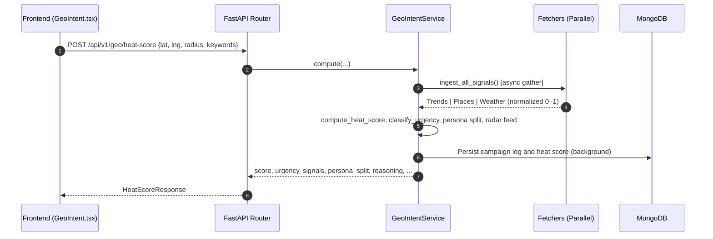
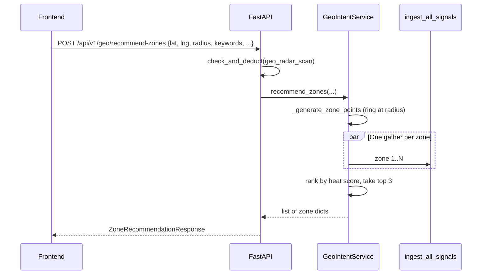

# Geo-Intent Marketing Engine — Internal Documentation

This document describes **everything related to the Geo-Intent module** in the RAAMP platform: signal fetching, heat score calculation, persona analysis, multi-zone recommendations, strategic brief generation, persistence, and frontend integration.

---

## Status (Implemented vs Remaining)

- **Implemented**
  - **Multi-Signal Ingestion**: Parallel fetching from Google Trends (keyword velocity), Google Places (POI density), and Tomorrow.io (weather impact).
  - **Heat Score Algorithm**: Weighted calculation (35% Trends, 40% Places, 25% Weather) with 0–100 normalization.
  - **Urgency Classification**: Low (0–30), Medium (31–60), High (61–89), Critical (90–100). *(See `classify_urgency` in `geo_intent_service.py`.)*
  - **Dynamic Persona Split**: POI-aware audience distribution (Office Commuters, Retail Shoppers, Food Visitors, Local Residents, Students) with hourly/weather modifiers.
  - **Restaurant-Specific Optimization** (2026-04-25):
    - **Backend AI prompts**: Detects restaurant businesses (restaurant, cafe, bakery, food keywords) and injects food-specific instructions into Gemini prompts
    - **Sensory language**: AI generates appetizing copy with words like "crispy", "juicy", "aromatic", "fresh", "savory", "delicious"
    - **Meal-specific time windows**: Breakfast (7-10:30am), Lunch (12-2:30pm), Happy Hour (5-7pm), Dinner (7-10pm) instead of generic time slots
    - **Frontend offer suggestions**: Time-aware offers ("breakfast special", "lunch deal", "happy hour", "dinner reservation") based on current hour
    - **Dining-focused language**: Uses "dine-in", "takeout", "delivery", "reservations" instead of generic business terms
  - **Multi-Zone Recommender**: `POST /api/v1/geo/recommend-zones` scores **4–8 compass points** on a ring at the scan radius (labels N, NE, E, …), runs the same signal pipeline per point in parallel, returns the **top 3** zones by heat score with a short reason string. One **`geo_radar_scan`** credit per request.
  - **Strategic Brief Generation**: AI-powered (Gemini) campaign planning including 3 caption variants (Aggressive, Soft, Urgency), budget advice, and meta-objectives; optional **Deploy Here** from a recommended zone uses that zone’s coordinates and signals.
  - **Export campaign package (Honest flow)**:
    - The Meta API “deploy draft” flow is removed (dead/brittle in demo scope).
    - From Top Zones, users open an **Export campaign package** modal and copy:
      - a **copy‑ready caption** (sanitized: no dash bullets)
      - **targeting parameters** (area name if available; otherwise short degree coordinates, radius in km)
      - **persona split** (only shown when valid; suppressed when it looks like fallback data)
    - Users manually open **Meta Ads Manager** and paste/build the campaign themselves.
  - **Tier-based Logic**: Signal gating (Free tier only gets full Places; Trends/Weather may be neutral with `status="limited"`; Premium gets full multi-signal access). Demo user `abdullah@gmail.com` is treated as premium where enforced in code.
  - **Persistence**: `campaign_logs` and `heat_scores` collections for history and heatmap layers; campaign briefs stored for strategy history.
  - **Frontend UI**:
    - Interactive map (center pin, radius circle, heatmap from history)
    - **Find Best Zones**: disabled while running + spinner + in-progress toast; map overlay shows “Finding best zones…” so the screen doesn’t look frozen
    - **Top Zones card**:
      - Shown as a **dedicated card** (not embedded inside “WHY THIS … IS HOT”)
      - Always visible with an **empty state** + “Find Best Zones” CTA (so users know where results will appear)
      - Results remain on screen **until the user re-runs** the multi-zone scan
      - Top Zones are cached client-side (localStorage) and restored on reload (scoped to business id)
      - Displays **area labels** via reverse geocode (cached). Falls back to map link for verification.
      - Includes a compact per-zone signal breakdown (Trends/Places/Weather %) to reduce “identical reason” confusion.
    - Strategy replay + signal-quality alerts when APIs are limited
    - **No polygon drawing** (Maps Drawing library removed for demo stability / deprecation)
  - **Analytics API**: Endpoints for daily heat score history, optimal posting time, and campaign brief listing.
  - **Maps script loader (single-load)**: frontend uses a shared loader (`loadGoogleMapsScript`) to avoid duplicate script injection.
  - **Timeout hardening**:
    - Backend: hard wall-clock cap on Geo-Intent Trends fetch to avoid hanging beyond frontend abort window.
    - Frontend: geo endpoints use longer timeouts; `recommend-zones` uses a longer default than `heat-score`.

- **Remaining / Potential Improvements**
  - **Dynamic Weight Tuning**: Allow the system (or AI) to tune signal weights by business category (e.g., weather weight higher for outdoor events).
  - **Geo-Intent notifications (high-signal only)**: Keep alerts genuinely useful and low-frequency. See **Section 8** for exact triggers and explicit non-goals.
  - **Competitor Proximity**: Deeper integration of local competitor density on the map (Trend Arbitrage has separate **Competitor Radar** elsewhere).

---

## 1. Overview

- **Purpose**
  - Provide a **hyper-local market radar** that identifies windows of high conversion opportunity.
  - Answer: *“Is now a good time to run an ad in my neighborhood, where on the ring should I bias spend, and what should I say?”*
- **Core Signal Proxy (Sensor Fusion)**:
  - **Macro-Intent (Velocity)**: Google Trends interest at regional/city level — broad consumer waves.
  - **Hyper-Local Context (Density)**: POI density from Google Places Nearby Search — grounds macro intent in a physical zone.
  - **Environmental Context (Mobility)**: Tomorrow.io weather — impact on mobility (indoor/outdoor awareness in fetcher).

---

## 2. Architecture

### A. Data Flow (Single-Point Radar Scan)

### B. Multi-Zone Recommendation Flow

- **Operations note**: Each zone runs a full `ingest_all_signals` (trends + places + weather for premium tier). That multiplies external API usage versus a single heat-score call.
  - **`RAAMP_ZONE_NUM_POINTS`**: clamped **4–8** (default **4** in code) reduces ring points if quotas/latency are tight.
  - **Frontend timeout**: `recommend-zones` defaults to **120s** to tolerate multi-zone scoring latency.

### C. Component Map

- **Backend**
  - `raamp-backend/application/services/geo_intent_service.py`: Orchestrator, `_generate_zone_points`, `recommend_zones`, persona, radar feed.
  - `raamp-backend/application/services/geo_intent_fetchers.py`: Trends, Places, weather; `ingest_all_signals`.
  - `raamp-backend/presentation/routers/geo_intent_engine_router.py`: All `/api/v1/geo/*` routes and campaign-brief orchestration.
  - `raamp-backend/application/services/geo_intent_cache.py`: TTL cache for fetchers.

- **Frontend**
  - `raamp-frontend/src/pages/GeoIntent.tsx`: Dashboard, heat scan, **Find Best Zones**, zone cards, Deploy / Deploy Here.
  - `raamp-frontend/src/components/GeoIntentMap.tsx`: Map, heatmap layer, radius circle, optional **zone pins**.
  - `raamp-frontend/src/components/GeoCampaignBriefModal.tsx`: Brief modal (scrollable).
  - `raamp-frontend/src/components/MetaDeployModal.tsx`: **Export campaign package** modal (no Meta API calls). Includes “Copy caption” + “Copy all as text” with preview. Uses area label when reverse‑geocoded (cached); otherwise shows short degree coordinates.
  - `raamp-frontend/src/services/geoIntentService.ts`: API client including `recommendZones`.
  - `raamp-frontend/src/lib/loadGoogleMapsScript.ts`: single Google Maps loader (`id="google-maps-api-script"`, shared Promise).

---

## 3. Signal Logic Details

### 3.1 Fetchers & Fallbacks

Each fetcher is isolated. On failure or timeout, scores tend toward **neutral (0.5)** so the engine keeps responding; `signals_status` records per-signal health (`ok`, `limited`, `failed`, etc.).

**Important hard timeout (Trends wall-clock)**:
- `geo_intent_fetchers.fetch_trends_score()` wraps `GoogleTrendsService.fetch_trends_data()` in `asyncio.wait_for(...)` because the provider stack (SerpAPI + pytrends in a thread pool) can otherwise exceed the frontend timeout.
- Config: `RAAMP_GEO_TRENDS_TIMEOUT_SEC` (default **12.0**, clamped **3–25**).

| Signal | Source | Role | Typical fallback |
| :--- | :--- | :--- | :--- |
| **Trends** | Google Trends (via provider stack) | Regional interest for keywords | Neutral score |
| **Places** | Google Places Nearby Search | POI count in radius (up to 2 pages) | Neutral score |
| **Weather** | Tomorrow.io realtime | Comfort / mobility proxy | Neutral score |

### 3.2 Dynamic Persona Split

Implemented in `GeoIntentService._calculate_persona_split()`: base mapping from POI `types`, plus modifiers for time-of-day, weather, and trends-derived weighting.

---

## 4. APIs

| Endpoint | Method | Description |
| :--- | :--- | :--- |
| `/api/v1/geo/heat-score` | POST | Full radar sweep: `business_id`, `keywords`, `latitude`, `longitude`, `radius` (meters), `is_indoor`. Persists log + heat point. **Cost:** `geo_radar_scan` (see credits). |
| `/api/v1/geo/recommend-zones` | POST | Multi-zone scan: same body shape as heat-score (see `ZoneRecommendationRequest`). Returns **top 3** zones with scores and signal breakdown. **Cost:** one `geo_radar_scan` per request. |
| `/api/v1/geo/heatmap` | GET | `business_id?`, `limit?` — GeoJSON-style features for map heatmap. |
| `/api/v1/geo/history/{business_id}` | GET | Recent campaign/radar logs. |
| `/api/v1/geo/heat-score/history/{business_id}` | GET | Daily aggregates for charts (`days` query). |
| `/api/v1/geo/best-posting-time/{business_id}` | GET | Peak hours from historical heat logs. |
| `/api/v1/geo/generate-campaign-brief` | POST | AI strategic brief + captions. **Cost:** `campaign_brief`. |
| `/api/v1/geo/campaign-briefs/{business_id}` | GET | List saved briefs. Server resolves `business_id` to the canonical geo key and filters by the current user so “Strategic History” doesn’t appear empty due to id mismatch. |
| `/api/v1/geo/campaign-brief/{brief_id}` | GET | Single brief by id. |

### 4.1 Meta Ads Manager export (Geo-Intent → manual paste)

Geo‑Intent no longer attempts to create campaigns via Meta’s API. Instead it exports a **campaign package** for manual use.

- **Frontend export includes**:
  - Caption (no dash bullets)
  - Targeting params:
    - Area name (reverse geocoded via Google Maps JS `Geocoder` when available; cached client-side)
    - Fallback: short degree coordinates (e.g. `31.59°N, 74.51°E`)
    - Radius in km
  - Persona split only when it looks valid (suppresses 100% single-persona fallbacks)
- **User action**: open Meta Ads Manager (`https://adsmanager.facebook.com`) and paste/build manually.

**Smoke / dev**

- `raamp-backend/tests/smoke_recommend_zones.py` — calls `GeoIntentService.recommend_zones` with Lahore demo coordinates (requires env + Mongo).

---

## 5. Security, Credits & Tiers

- **Credits** (`credit_service.ACTION_COSTS`):
  - **`geo_radar_scan`**: **2** credits — applies to **heat-score** and **recommend-zones** (each call).
  - **`campaign_brief`**: **3** credits — `generate-campaign-brief`.
- **Demo bypass**: User `abdullah@gmail.com` is granted premium-style behavior where implemented (e.g. credits / tier checks).
- **Tier gating** (in `ingest_all_signals`):
  - **Free**: Trends and weather may be forced to neutral with `limited` status; Places still runs.
  - **Premium**: Full parallel trends, places, weather.

---

## 6. Known Limitations

1. **Signal scope**: Trends are regional; local relevance is anchored by Places (and zone points for multi-zone).
2. **Weather**: Third-party latency or rate limits (e.g. HTTP 429) can degrade that signal for a run.
3. **Places quota**: Nearby Search is invoked per zone in **recommend-zones**; use **`RAAMP_ZONE_NUM_POINTS=6`** (or `4`) if bursts hit Google Maps quotas.
4. **Heatmap “liveness”**: The map layer reflects **persisted** heat points from scans, not a continuous real-time stream unless users scan frequently.
5. **External provider variance**: Even with timeouts, Trends/Weather can degrade under rate limits; UI should treat ~50% signals as neutral fallback, not “weak market”.

---

## 7. Current Gaps / Follow-ups (as of 2026-04-21)

- **Human-readable zone naming (Actionability gap)**:
  - Current: zones show **labels** and attempt to resolve a **friendly area label** via reverse geocode (cached). When a label isn’t available, the UI falls back to short degree coordinates (verifiable, but less actionable).
  - Target: display a **friendly place label**:
    - Examples: “Near Cavalry Ground”, “Gulberg Main Blvd”, “DHA Phase 4”
  - Implementation options:
    - **Reverse geocoding**: call a geocoder (Google Geocoding API / Places “nearby” best-match) for each zone point; cache results by `lat,lng` (rounded) for 7–30 days.
    - **POI centroid naming**: if Places data is already fetched, reuse the top POI names/types to name the zone (“Retail cluster near X”).
    - **UI fallback**: show both `Zone NE` and the nearest known landmark once available; keep the map link.
  - **Current implementation (frontend)**:
    - Geo‑Intent uses Google Maps JS `Geocoder` when available and caches area labels in `localStorage` (`raamp_geo_area_cache_v1`).
    - UI shows resolved area labels in Top Zones and in the export package; if not available, it falls back to short degree coordinates.

- **Signal transparency (Trust gap)**:
  - Problem: a heat score like `76/100` looks the same whether it’s **3 strong signals** or **2 neutral fallbacks + 1 real**.
  - Target UX:
    - Show a **Confidence/Quality** chip next to the score: `High / Medium / Limited` based on `signals_status`.
    - Show per-signal status at-a-glance (`Trends: ACTIVE`, `Places: ACTIVE`, `Weather: LIMITED`) with tooltip “why this is limited”.
    - For recommended zones: include a compact “signal mix” row (3 tiny bars / dots).
  - Backend support:
    - ensure `signals_status` / per-zone `signals` are always returned and stable.
    - optionally add `confidence_score` derived from coverage + recency.

- **Heatmap & history are passive (Staleness gap)**:
  - Current: heatmap reflects **past scans only**; if the user doesn’t scan, the map looks stale.
  - Target UX:
    - Add a “Last scan” time + “Stale” badge (`>30m`, `>2h`, `>24h`) and a one-click **Rescan** CTA.
    - Add contextual nudges (“Weather shifted”, “Lunch rush window”) once signals change.
  - Implementation options:
    - **Lightweight polling** for a “should rescan” hint (no full scan) OR scheduled background scan (credit-aware).
    - Notifications/alerts **only** on meaningful events (threshold crossing, best-hour daily, signal degraded). See **Section 8**.

- **Multi-zone scan progress feels like a black box (Perceived reliability gap)**:
  - Current: button disables + spinner; multi-zone can take 30–60s.
  - Target UX:
    - Show step progress: “Scored 2/6 zones…”
    - Show elapsed time + “still working” heartbeat.
  - Implementation options:
    - Backend returns a `job_id` and exposes `GET /recommend-zones/{job_id}/status` with counters.
    - Or stream partial results (SSE/WebSocket) so zones appear incrementally.

- **Persona split isn’t surfaced prominently (Most actionable output)**:
  - Current: persona split exists but is visually buried relative to other panels.
  - Target UX:
    - Promote “Top persona now” near the caption/brief area (e.g., “60% Office Commuters”).
    - Show persona-driven caption hints (“commute-time hook”, “lunch-break CTA”) or persona-aware template presets.
    - Include personas in the exported campaign package (done).

- **Closed-loop attribution missing (Learning gap)**:
  - Current: the module generates briefs and packages, but does not learn from outcomes.
  - Target:
    - Capture “what was deployed” (creative + targeting) and link to results (CTR, CPM, CPA, ROAS).
    - Feed outcomes back into weights/heuristics and into next brief generation.
  - Implementation options:
    - Manual outcome input (MVP) + later Meta Ads Insights ingestion (where permitted).
    - Store an “experiment” entity: `zone + signals + persona + caption + budget + objective + outcome`.

---

*Last updated: 2026-04-25*

**Recent Updates:**
- **2026-04-25**: Added restaurant-specific optimization to Geo-Intent module (meal-time aware offers, sensory language in AI prompts, dining-focused time windows)

---

## 8. Geo-Intent Notifications — What We Send (and What We Don’t)

The goal is **signal, not noise**. Geo-Intent already has frequent UI feedback (map, score, logs, modals). Notifications should only fire when they change what the operator should do **right now**.

### 8.1 Notifications worth sending (only 3)

#### 1) Heat spike in your zone (threshold crossings only)

- **Trigger**: A *new* scan’s urgency crosses upward into a higher band compared to the **previous scan for the same business + radius**.
  - Example crossings:
    - `Medium → High`
    - `High → Critical`
- **Do not trigger**:
  - If urgency stays the same (prevents repeated flat-score spam like the “54/100 again” dashboard issue)
  - On `Low → Medium` (too frequent / low stakes)
- **Suggested copy**:
  - “Your 18km zone just crossed into Critical (91/100). Good window to run now.”

#### 2) Best time to post — daily (quiet scheduled utility)

- **Trigger**: Once per day per business, based on `/api/v1/geo/best-posting-time/{business_id}`.
  - Schedule: local time (e.g., morning), **one** notification only.
- **Suggested copy**:
  - “Peak intent window starting in Gulberg area. Today’s best hour: 5–6pm.”

#### 3) Signal degraded — score may be off (trust/quality warning)

- **Trigger**: In a scan, **2 or more** signals are not healthy (e.g. `limited`, `failed`, `neutral`, or otherwise non-`ok`) in `signals_status`.
  - Rationale: warns only when the fused score is more likely to be a conservative/neutral blend.
- **Suggested copy**:
  - “Today’s scan used limited signals. Heat score may be conservative.”

### 8.2 What we should NOT notify on (explicit non-goals)

- Every scan completion (noise)
- Multi-zone scan finished (they triggered it and are watching the screen)
- Brief generated (they are already in the modal)
- Medium urgency scores (too frequent, too low stakes)
- Score staying flat across scans (prevents repeated-notification loops)
