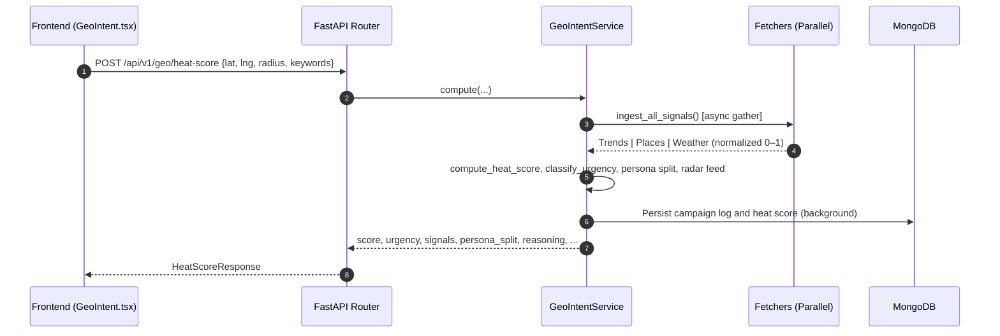
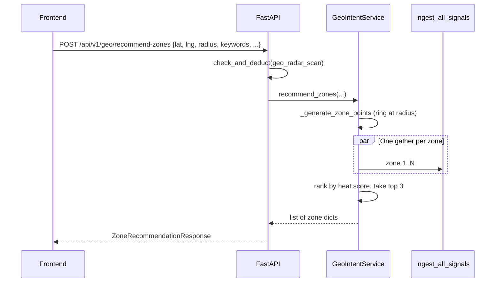

# Geo-Intent Marketing Engine — Internal Documentation

This document describes **everything related to the Geo-Intent module** in the RAAMP platform: signal fetching, heat score calculation, persona analysis, multi-zone recommendations, strategic brief generation, persistence, and frontend integration.

---

## Status (Implemented vs Remaining)

- **Implemented**
  - **Multi-Signal Ingestion**: Parallel fetching from Google Trends (keyword velocity), Google Places (POI density), and Tomorrow.io (weather impact).
  - **Heat Score Algorithm**: Weighted calculation (35% Trends, 40% Places, 25% Weather) with 0–100 normalization.
  - **Urgency Classification**: Low (0–30), Medium (31–60), High (61–89), Critical (90–100). *(See `classify_urgency` in `geo_intent_service.py`.)*
  - **Dynamic Persona Split**: POI-aware audience distribution (Office Commuters, Retail Shoppers, Food Visitors, Local Residents, Students) with hourly/weather modifiers.
  - **Multi-Zone Recommender**: `POST /api/v1/geo/recommend-zones` scores **4–8 compass points** on a ring at the scan radius (labels N, NE, E, …), runs the same signal pipeline per point in parallel, returns the **top 3** zones by heat score with a short reason string. One **`geo_radar_scan`** credit per request.
  - **Strategic Brief Generation**: AI-powered (Gemini) campaign planning including 3 caption variants (Aggressive, Soft, Urgency), budget advice, and meta-objectives; optional **Deploy Here** from a recommended zone uses that zone’s coordinates and signals.
  - **Meta Ads “Deploy as Draft” (Paused)**:
    - After Facebook OAuth, the backend fetches and persists the user’s **ad accounts** (`/me/adaccounts`) in `facebook_connections.ad_accounts`.
    - Frontend opens `MetaDeployModal` from a zone card, lets the user choose:
      - an **Ad Account**
      - a **Facebook Page** (required for the creative)
      - a caption variant + daily budget
    - Backend creates a **paused** campaign/adset/creative/ad via Meta Marketing API and returns an **Ads Manager URL**.
  - **Tier-based Logic**: Signal gating (Free tier only gets full Places; Trends/Weather may be neutral with `status="limited"`; Premium gets full multi-signal access). Demo user `abdullah@gmail.com` is treated as premium where enforced in code.
  - **Persistence**: `campaign_logs` and `heat_scores` collections for history and heatmap layers; campaign briefs stored for strategy history.
  - **Frontend UI**:
    - Interactive map (center pin, radius circle, heatmap from history)
    - **Find Best Zones**: disabled while running + spinner + in-progress toast; map overlay shows “Finding best zones…” so the screen doesn’t look frozen
    - **Top Zones card**: shown as a **dedicated card** (not embedded inside “WHY THIS … IS HOT”), includes **lat/lng** + a “View on map” link per zone
    - Strategy replay + signal-quality alerts when APIs are limited
    - **No polygon drawing** (Maps Drawing library removed for demo stability / deprecation)
  - **Analytics API**: Endpoints for daily heat score history, optimal posting time, and campaign brief listing.
  - **Maps script loader (single-load)**: frontend uses a shared loader (`loadGoogleMapsScript`) to avoid duplicate script injection.
  - **Timeout hardening**:
    - Backend: hard wall-clock cap on Geo-Intent Trends fetch to avoid hanging beyond frontend abort window.
    - Frontend: geo endpoints use longer timeouts; `recommend-zones` uses a longer default than `heat-score`.

- **Remaining / Potential Improvements**
  - **Dynamic Weight Tuning**: Allow the system (or AI) to tune signal weights by business category (e.g., weather weight higher for outdoor events).
  - **Real-Time Push Notifications**: Trigger mobile/web alerts when a Critical heat score is detected in a user’s zone.
  - **Competitor Proximity**: Deeper integration of local competitor density on the map (Trend Arbitrage has separate **Competitor Radar** elsewhere).

---

## 1. Overview

- **Purpose**
  - Provide a **hyper-local market radar** that identifies windows of high conversion opportunity.
  - Answer: *“Is now a good time to run an ad in my neighborhood, where on the ring should I bias spend, and what should I say?”*
- **Core Signal Proxy (Sensor Fusion)**:
  - **Macro-Intent (Velocity)**: Google Trends interest at regional/city level — broad consumer waves.
  - **Hyper-Local Context (Density)**: POI density from Google Places Nearby Search — grounds macro intent in a physical zone.
  - **Environmental Context (Mobility)**: Tomorrow.io weather — impact on mobility (indoor/outdoor awareness in fetcher).

---

## 2. Architecture

### A. Data Flow (Single-Point Radar Scan)

### B. Multi-Zone Recommendation Flow

- **Operations note**: Each zone runs a full `ingest_all_signals` (trends + places + weather for premium tier). That multiplies external API usage versus a single heat-score call.
  - **`RAAMP_ZONE_NUM_POINTS`**: clamped **4–8** (default **4** in code) reduces ring points if quotas/latency are tight.
  - **Frontend timeout**: `recommend-zones` defaults to **120s** to tolerate multi-zone scoring latency.

### C. Component Map

- **Backend**
  - `raamp-backend/application/services/geo_intent_service.py`: Orchestrator, `_generate_zone_points`, `recommend_zones`, persona, radar feed.
  - `raamp-backend/application/services/geo_intent_fetchers.py`: Trends, Places, weather; `ingest_all_signals`.
  - `raamp-backend/presentation/routers/geo_intent_engine_router.py`: All `/api/v1/geo/*` routes and campaign-brief orchestration.
  - `raamp-backend/application/services/geo_intent_cache.py`: TTL cache for fetchers.

- **Frontend**
  - `raamp-frontend/src/pages/GeoIntent.tsx`: Dashboard, heat scan, **Find Best Zones**, zone cards, Deploy / Deploy Here.
  - `raamp-frontend/src/components/GeoIntentMap.tsx`: Map, heatmap layer, radius circle, optional **zone pins**.
  - `raamp-frontend/src/components/GeoCampaignBriefModal.tsx`: Brief modal (scrollable), caption variants sanitized (no dash characters).
  - `raamp-frontend/src/components/MetaDeployModal.tsx`: Meta deploy modal — fetches ad accounts + creates **paused** drafts in Meta.
  - `raamp-frontend/src/services/geoIntentService.ts`: API client including `recommendZones`.
  - `raamp-frontend/src/lib/loadGoogleMapsScript.ts`: single Google Maps loader (`id="google-maps-api-script"`, shared Promise).

---

## 3. Signal Logic Details

### 3.1 Fetchers & Fallbacks

Each fetcher is isolated. On failure or timeout, scores tend toward **neutral (0.5)** so the engine keeps responding; `signals_status` records per-signal health (`ok`, `limited`, `failed`, etc.).

**Important hard timeout (Trends wall-clock)**:
- `geo_intent_fetchers.fetch_trends_score()` wraps `GoogleTrendsService.fetch_trends_data()` in `asyncio.wait_for(...)` because the provider stack (SerpAPI + pytrends in a thread pool) can otherwise exceed the frontend timeout.
- Config: `RAAMP_GEO_TRENDS_TIMEOUT_SEC` (default **12.0**, clamped **3–25**).

| Signal | Source | Role | Typical fallback |
| :--- | :--- | :--- | :--- |
| **Trends** | Google Trends (via provider stack) | Regional interest for keywords | Neutral score |
| **Places** | Google Places Nearby Search | POI count in radius (up to 2 pages) | Neutral score |
| **Weather** | Tomorrow.io realtime | Comfort / mobility proxy | Neutral score |

### 3.2 Dynamic Persona Split

Implemented in `GeoIntentService._calculate_persona_split()`: base mapping from POI `types`, plus modifiers for time-of-day, weather, and trends-derived weighting.

---

## 4. APIs

| Endpoint | Method | Description |
| :--- | :--- | :--- |
| `/api/v1/geo/heat-score` | POST | Full radar sweep: `business_id`, `keywords`, `latitude`, `longitude`, `radius` (meters), `is_indoor`. Persists log + heat point. **Cost:** `geo_radar_scan` (see credits). |
| `/api/v1/geo/recommend-zones` | POST | Multi-zone scan: same body shape as heat-score (see `ZoneRecommendationRequest`). Returns **top 3** zones with scores and signal breakdown. **Cost:** one `geo_radar_scan` per request. |
| `/api/v1/geo/heatmap` | GET | `business_id?`, `limit?` — GeoJSON-style features for map heatmap. |
| `/api/v1/geo/history/{business_id}` | GET | Recent campaign/radar logs. |
| `/api/v1/geo/heat-score/history/{business_id}` | GET | Daily aggregates for charts (`days` query). |
| `/api/v1/geo/best-posting-time/{business_id}` | GET | Peak hours from historical heat logs. |
| `/api/v1/geo/generate-campaign-brief` | POST | AI strategic brief + captions. **Cost:** `campaign_brief`. |
| `/api/v1/geo/campaign-briefs/{business_id}` | GET | List saved briefs. Server resolves `business_id` to the canonical geo key and filters by the current user so “Strategic History” doesn’t appear empty due to id mismatch. |
| `/api/v1/geo/campaign-brief/{brief_id}` | GET | Single brief by id. |

### 4.1 Meta deploy support endpoints (Geo-Intent → Ads Manager bridge)

These endpoints support the **“Deploy as Draft”** flow from Geo-Intent.

#### A) Fetch ad accounts (for dropdown)

- **Method/Path**: `GET /api/profile/connections/facebook/ad-accounts`
- **Auth**: required
- **Returns**:
  - `ad_accounts[]`: the persisted list fetched from Meta during OAuth
  - `selected_ad_account_id`: last user selection (optional)

#### B) Persist selected ad account (UX convenience)

- **Method/Path**: `POST /api/profile/connections/facebook/ad-accounts/select`
- **Auth**: required
- **Body**: `{ "ad_account_id": "act_123..." }`
- **Returns**: `{ "ok": true|false }`

#### C) Create paused campaign draft in Meta

- **Method/Path**: `POST /api/v1/meta/deploy-draft`
- **Auth**: required
- **Notes**:
  - Creates **Campaign**, **Ad Set**, **Creative**, and **Ad** with `status="PAUSED"`.
  - Returns `ads_manager_url` for the user to review/publish in Meta Ads Manager.
  - Errors are logged server-side, but responses should remain **user-safe** (no raw Meta/dev strings).

**Smoke / dev**

- `raamp-backend/tests/smoke_recommend_zones.py` — calls `GeoIntentService.recommend_zones` with Lahore demo coordinates (requires env + Mongo).

---

## 5. Security, Credits & Tiers

- **Credits** (`credit_service.ACTION_COSTS`):
  - **`geo_radar_scan`**: **2** credits — applies to **heat-score** and **recommend-zones** (each call).
  - **`campaign_brief`**: **3** credits — `generate-campaign-brief`.
- **Demo bypass**: User `abdullah@gmail.com` is granted premium-style behavior where implemented (e.g. credits / tier checks).
- **Tier gating** (in `ingest_all_signals`):
  - **Free**: Trends and weather may be forced to neutral with `limited` status; Places still runs.
  - **Premium**: Full parallel trends, places, weather.

---

## 6. Known Limitations

1. **Signal scope**: Trends are regional; local relevance is anchored by Places (and zone points for multi-zone).
2. **Weather**: Third-party latency or rate limits (e.g. HTTP 429) can degrade that signal for a run.
3. **Places quota**: Nearby Search is invoked per zone in **recommend-zones**; use **`RAAMP_ZONE_NUM_POINTS=6`** (or `4`) if bursts hit Google Maps quotas.
4. **Heatmap “liveness”**: The map layer reflects **persisted** heat points from scans, not a continuous real-time stream unless users scan frequently.
5. **External provider variance**: Even with timeouts, Trends/Weather can degrade under rate limits; UI should treat ~50% signals as neutral fallback, not “weak market”.

---

## 7. Current Gaps / Follow-ups (as of 2026-04-20)

- **Human-readable zone naming**: We show **lat/lng + Google Maps link**, but we don’t yet reverse-geocode into “road/area name” inside the app.
- **Signal diagnostics clarity**: Premium users can still see degraded signals from **quota / missing keys / upstream outages**; UI copy is improved, but we don’t yet surface a per-provider “why” panel (e.g., Places `REQUEST_DENIED` vs timeout).
- **Latency predictability**: External providers can still be slow. We added a hard Trends wall-time cap, but end-to-end runtime can still vary with Places/Weather latency.
- **Multi-zone progress granularity**: We block double-clicks and show “in progress,” but there’s no step-by-step progress (e.g., “scored zone 3/4”) or partial-result streaming.
- **Blueprint preview without a generated brief**: Before you generate a brief, the preview is still a deterministic fallback (not fully AI-driven).
- **Map intelligence depth**: No competitor overlays, travel-time/routing context, or category POI layers yet.
- **Personalization**: Signal weights and heuristics are mostly fixed; no per-business-type tuning or learning loop.
- **Alerts**: No push/mobile “heat spike” notifications in the Geo-Intent module (only optional activity logging).
- **Closed-loop attribution**: Geo-Intent doesn’t yet tie “brief → campaign → ROI” into a unified feedback loop within the module.
- **Meta deploy hard requirements**:
  - Meta deploy requires a **Facebook Page ID** for the ad creative.
  - Ads endpoints require Meta permissions (`ads_read`, `ads_management`) to be granted at OAuth time.

---

*Last updated: 2026-04-20*
