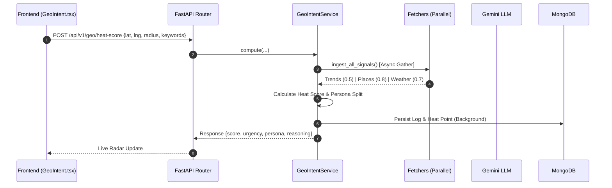

# Geo-Intent Marketing Engine — Internal Documentation

This document describes **everything related to the Geo-Intent module** in the RAAMP platform: signal fetching, heat score calculation, persona analysis, strategic brief generation, persistence, and frontend integration.

---

## Status (Implemented vs Remaining)

- **Implemented**
  - **Multi-Signal Ingestion**: Parallel fetching from Google Trends (keyword velocity), Google Places (POI density), and Tomorrow.io (weather impact).
  - **Heat Score Algorithm**: Weighted calculation (35% Trends, 40% Places, 25% Weather) with 0–100 normalization.
  - **Urgency Classification**: Low (0–30), Medium (31–60), High (61–90), Critical (91+).
  - **Dynamic Persona Split**: POI-aware audience distribution (Office Commuters, Retail Shoppers, Food Visitors, Local Residents, Students) with hourly/weather modifiers.
  - **Strategic Brief Generation**: AI-powered (Gemini) campaign planning including 3 caption variants (Aggressive, Soft, Urgency), budget advice, and meta-objectives.
  - **Tier-based Logic**: Signal gating (Free tier only gets Google Places; Premium gets Trends + Weather).
  - **Persistence**: `campaign_logs` and `heat_scores` collections for history and heatmap layers.
  - **Frontend UI**: Interactive map with custom zone drawing, live radar feed pings, and strategy replay.
  - **Analytics API**: Endpoints for daily heatmap history and optimal posting time analysis.

- **Remaining / Potential Improvements**
  - **Dynamic Weight Tuning**: Allow the system (or AI) to tune signal weights based on business category (e.g., weather weight higher for Outdoor Events).
  - **Real-Time Push Notifications**: Trigger mobile/web alerts when a "Critical" heat score (90+) is detected in a user's locked zone.
  - **Competitor Proximity**: Integrate SerpAPI local results to show specific competitor density on the map.

---

## 1. Overview

- **Purpose**
  - Provide a **hyper-local market radar** that identifies windows of high conversion opportunity.
  - Answer the question: *"Is now a good time to run an ad in my neighborhood, and what should I say?"*
- **Core Signal Proxy (Sensor Fusion)**:
  - **Macro-Intent (Velocity)**: Google Trends interest at the regional/city level. This identifies broad consumer waves.
  - **Hyper-Local Context (Density)**: Physical commercial POI density from Google Places (street-level). This grounds the macro-intent in a physical zone.
  - **Environmental Context (Mobility)**: Real-time weather impact on consumer mobility (street-level).

---

## 2. Architecture

### A. Data Flow (Radar Scan)

### B. Component Map

- **Backend**
  - `raamp-backend/application/services/geo_intent_service.py`: Main orchestrator and persona logic.
  - `raamp-backend/application/services/geo_intent_fetchers.py`: Implementation of 3rd party API connectors.
  - `raamp-backend/presentation/routers/geo_intent_engine_router.py`: API endpoints and AI brief generation logic.
  - `raamp-backend/application/services/geo_intent_cache.py`: TTL-based caching layer.

- **Frontend**
  - `raamp-frontend/src/pages/GeoIntent.tsx`: Main dashboard with radar and metrics.
  - `raamp-frontend/src/components/GeoIntentMap.tsx`: Google Maps integration (Marker, Heatmap, DrawingManager).
  - `raamp-frontend/src/services/geoIntentService.ts`: API client.

---

## 3. Signal Logic Details

### 3.1 Fetchers & Fallbacks
Each fetcher is isolated. If an API fails or times out, it returns a **Neutral Score (0.5)** to ensure the engine remains resilient.

| Signal | Source | Logic | Fallback |
| :--- | :--- | :--- | :--- |
| **Trends** | Google Trends | Interest velocity for top 5 niche keywords (7-day window). | 0.5 |
| **Places** | Google Places | POI density within radius (Scales: 40+ venues = 1.0). | 0.5 |
| **Weather** | Tomorrow.io | Comfort range (22°C) + Rain Factor (helps Indoor/hurts Outdoor). | 0.5 |

### 3.2 Dynamic Persona Split
Calculated in `GeoIntentService._calculate_persona_split()`. It uses a base mapping of POI types (from Google Places) and applies modifiers:
- **Time of Day**: Commuters peak in mornings (7-10 AM); Food/Retail peak at lunch/evening.
- **Weather**: Rain boosts "Local Residents" (staying near home) and hurts "Retail Shoppers" (mobility loss).
- **Trends**: High digital intent boosts "Retail Shoppers" and "Food Visitors".

---

## 4. APIs

| Endpoint | Method | Parameters | Description |
| :--- | :--- | :--- | :--- |
| `/api/v1/geo/heat-score` | POST | `lat, lng, radius, keywords, is_indoor` | Triggers a full radar sweep and calculates persona/reasoning. |
| `/api/v1/geo/heatmap` | GET | `business_id?, limit?` | Returns GeoJSON points for Map heatmap layer. |
| `/api/v1/geo/history/{id}` | GET | `limit?` | Recent radar log history. |
| `/api/v1/geo/generate-campaign-brief` | POST | `lat, lng, heat_score, persona_split, ...` | Uses Gemini to build a strategic marketing blueprint. |
| `/api/v1/geo/best-posting-time/{id}` | GET | none | Analyzes historical logs to find peak conversion hours. |

---

## 5. Security & Tiers

- **Credit System**: 
  - Radar Scan = **2 Credits**
  - Strategy Brief = **5 Credits**
- **Tier Gating**:
  - **Free Tier**: Only receives **Google Places (Density)** signal. Trends and Weather are returned as `neutral` with `status="limited"`.
  - **Premium/Demo Tier**: Full multi-signal access.

---

## 6. Known Limitations

1. **Signal Scope Calibration**: Digital intent (Trends) is intentionally measured at the regional/state level to capture 'Macro Waves.' The system's 'Hyper-Local' accuracy is achieved by multiplying this macro-intent against 100% granular local signals (Google Places & Weather).
2. **Weather Granularity**: Tomorrow.io provides excellent local weather, but rapid micro-climate shifts may have a 5-10 min lag in the API.
3. **Map Token Usage**: Excessive custom zone drawing triggers multiple Nearby Search calls; governed by frontend debouncing.

---
*Last Updated: 2026-04-09*
