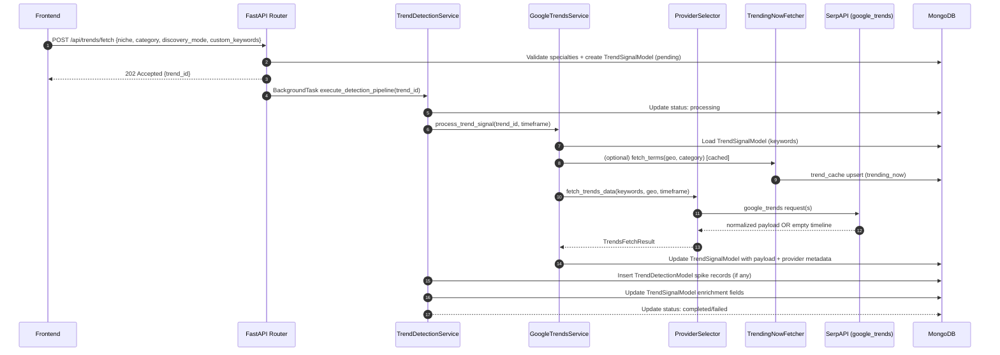

# Trends System (Backend) — Internal Documentation

This document describes **everything related to the Trend system** in the RAAMP backend: discovery, time-series fetching, spike detection, enrichment, persistence, analytics APIs, retries, and known gaps.

---

## Status (Implemented vs Remaining)

This section is a **living checklist** so you can immediately see what’s left.

- **Implemented (recent changes)**
  - **DB-backed cache (TTL)**: `trend_cache` collection used for Google Trends time-series and SerpAPI Trending Now (no more process-local caches).
  - **Trending Now cache stability**: fixed Beanie `upsert(..., on_insert=...)` so Trending Now and Google Trends caches write reliably.
  - **Retry queue deduplication**:
    - Enqueue-side skip if a `pending/running` job already exists for the same `trend_id`.
    - Worker-side safety skip if another job for same `trend_id` is already `running`.
  - **Provider normalization**:
    - Shared internal contract in `trends_providers/schemas.py` and normalization in both providers.
    - Selector validates normalized payload and treats bad payloads as retryable (to allow fallback).
  - **Provider payload validation (central + service defense-in-depth)**:
    - Ensures non-empty dates, series length alignment, and rejects all-zero/all-null series before downstream processing.
  - **SerpAPI recovery ladder** (empty timeline handling):
    - When SerpAPI returns `200` but no timeline, the provider performs a recovery sequence (keyword reorder → 12m window → geo relax).
    - Only after the ladder fails do we mark SerpAPI as **non-retryable** (no PyTrends fallback for empty timelines).
    - Provider emits `geo_relaxed=true` when the scan required global relaxation.
  - **Detection parameters configurable**:
    - Env vars: `TREND_Z_THRESHOLD`, `TREND_ROLLING_WINDOW_DAYS`, `TREND_EWMA_ALPHA`, `TREND_MIN_DATA_POINTS`.
    - Pipeline logs the parameter values used per scan.
  - **No fake analytics**:
    - Bubble chart no longer bootstraps synthetic points.
    - Platform reach is gated: returns `is_real=false` until real platform bias exists.
  - **Provenance standardization (partial)**:
    - `trend_detections` now stores `is_real_social`, `is_real_saturation`, `is_real_events`.
    - Analytics endpoints now return a `data_quality` object as part of response contracts (schemas added).
  - **Keyword control / scan gating**
    - **User-defined keywords**: `custom_keywords` accepted on `POST /api/trends/fetch` and merged into the scan keyword set.
    - **Business specialties required**: scans enforce at least 1 specialty (precondition) to avoid low-signal scans.
    - **Background scan behavior**: global APScheduler scan will **skip** users missing specialties, but sends a **one-time** notification prompting them to update **Settings → Business Specialties**.
      - One-time guard key: `notification.metadata.sub_type="specialties_required"`
    - **Reproducible scan keywords**: discovery/custom keyword merges are persisted via `TrendSignalModel` (no `.save()` on domain entities).
    - **Time-series keyword cap**: time-series fetch uses the top 8 keywords to prioritize high-signal terms and reduce empty timelines.
  - **Structured observability via JSON logs**:
    - Events emitted: `trends.pipeline.completed`, `trends.provider.rate_limited`, `trends.provider.fallback`,
      `trends.retry.enqueued`, `trends.retry.succeeded`, `trends.retry_worker.run`.
    - Standard fields included: `timestamp`, `trend_id`, `user_id` (when applicable).

- **Remaining / follow-ups**
  - **Retry failure events**: **Implemented**
    - Worker emits:
      - `trends.retry.failed` on every retry exception
      - `trends.retry.exhausted` when max attempts are reached
  - **Backfill/migration**: **Implemented (optional)**
    - Script: `raamp-backend/scripts/migrate_trends_fields.py`
    - Idempotent backfill for historical docs:
      - `trend_signals`: `provider`, `fallback_from`, `geo_relaxed`, `is_real_*`
      - `trend_detections`: `is_real_*`
  - **Instagram “connected but expired” health**: **Implemented**
    - `GET /api/trends/instagram/health` uses `InstagramGraphAPIClient.validate_token_reachability()`
      to distinguish “not connected” vs “token unreachable”.
  - **Restrict debug/admin endpoints**:
    - **Implemented**: endpoints are admin/dev guarded and disabled in prod by default.
    - Guards:
      - `RAAMP_ADMIN_MODE=1` **or**
      - header `X-RAAMP-Admin-Token` matching `RAAMP_ADMIN_TOKEN`
    - Production default: 404 unless `RAAMP_ALLOW_DEBUG_ENDPOINTS_IN_PROD=1`
  - **Persistent metrics destination**:
    - **Implemented (optional)**: `emit_event()` can forward to Sentry when enabled.
    - Enable via:
      - `RAAMP_OBS_SENTRY_ENABLED=1`
      - `SENTRY_DSN=...`
      - optional: `SENTRY_TRACES_SAMPLE_RATE=0.0..1.0`

  - **Trend AI Analysis (new)**: **Implemented**
    - Dedicated collection: `trend_ai_analysis` (separate from `trend_detections` so it can be regenerated independently)
    - Auto-triggered after scans complete (non-blocking background task)
    - Adds `ai_analysis_status` to:
      - `GET /api/trends/latest`
      - `GET /api/trends/{trend_id}/status`
    - Endpoints:
      - `GET /api/trends/{trend_id}/ai-analysis`
      - `POST /api/trends/{trend_id}/ai-analysis/regenerate`
      - Execute (streamed, not persisted):
        - `POST /api/trends/{trend_id}/execute/draft-caption`
        - `POST /api/trends/{trend_id}/execute/generate-hooks`
        - `POST /api/trends/{trend_id}/execute/blog-outline`
        - `POST /api/trends/{trend_id}/execute/ad-copy`

  - **Intelligence endpoints (new)**: **Implemented**
    - Viral audio (cached):
      - `GET /api/trends/viral-audio?platform={platform}&geo={geo}&niche={niche}`
      - Source is **Apple Music RSS** via `ViralAudioProvider` and must be labeled as **“Trending Audio (charting)”** (not “Instagram trending”)
      - Cached in `trend_cache` for **6 hours**
    - Competitor Radar (Benchmarking, cached):
      - `GET /api/trends/influencer-radar?geo={geo}&niche={niche}&keyword={keyword}`
      - Uses `InstagramGraphAPIClient` hashtag search + recent media analysis.
      - **Benchmarks**: Extracts competitor handles, calculates engagement **Heat** scores (likes+comments), and returns **Proof-of-Trend URLs** (permalinks).
      - Cached in `trend_cache` for **12 hours**.

---

## Trends UX/Product Roadmap (Done vs Planned)

This section tracks **front-end UX + product features** for the Trends screen (not just backend plumbing).

### Done (already implemented)
- **Ticker strip pinned to top** (Trends page): the scrolling ticker (e.g. “RR vs MI …”) is rendered at the **top of the screen** (sticky).
- **Active trend as source of truth (frontend)**:
  - Users set an **Active trend** by selecting a card.
  - Right-side intelligence (AI status, Intelligence Grid, drawer CTAs) follows Active trend instead of implicitly using “top trend”.
  - Active trend is visually highlighted on the selected card.
- **Trends intelligence tabs simplified**:
  - Tabs are now **two**:
    - **Regional**: what’s trending in **PK** (Trending Now).
    - **Business trends (global)**: what’s trending **globally in the user’s niche** (Industry Trends).
  - Clicking a chip adds it to scan keywords and shows a toast confirmation.
- **Premium card/CTA polish**:
  - Trend card primary CTA is **Create** (not “Execute”) and secondary metrics are de-emphasized by default.
- **Drawer execute UX**:
  - Outputs are scrollable and include **Copy** + **Open in Creative** actions.
- **Launch Campaign uses the existing approval-gated flow**:
  - Trends screen opens `LaunchCampaignDialog` and submits via `POST /api/campaign-launch/request`.
- **Removed “Recommended next action” banner** from Trends.
- **Removed “Create Pack” CTA** from Trends (pack creation is handled elsewhere; Trends stays focused on signals + launch).

### Planned

#### A) Layout + workflow clarity

### B) Context awareness (no wrong entity names)
- **Trend classifier step** (sports/news/brand/product/other) and show the label in UI.
- **`X vs Y` resolver (safe)**:
  - Deterministic abbreviation mapping (e.g. IPL/PSL common pairs) + confidence scoring.
  - If not confident: mark as **ambiguous** and suggest 1–2 follow-up scan keywords.
  - Do **not** guess wrong team/entity names (hurts trust + downstream performance).
- **Tournament calendar tie-in** (optional):
  - If the resolver is confident and a fixture source is available, attach match timing to “why now”.

### C) Notifications + retention loops
- **Watchlist alerts → in-app notifications**:
  - Triggers: profit score > X, spike detected, saturation drop > Y, lifecycle change.
  - Persist notifications and deep-link back to Trends with the trend pre-selected as Active.
- **Trend changes feed (on-page)**:
  - Show events like: “moved up”, “new spike”, “cooling”.
  - Clicking an event sets Active trend.

### D) Execution: from insight → assets → launch (closed loop)
- **One-click Create Pack** (optional, not on Trends page): generates Carousel + Reel + Story prompts for the same Active trend.
- **Campaign drafts**:
  - Save generated outputs as drafts (not just copy/paste).
  - Drafts should be reopenable in Creative Studio.
- **Launch Campaign prefill**:
  - Prefill platform, hashtags, and caption template using AI analysis + business profile.

### E) Better decision support
- **Competitor Benchmarking (Radar)**:
  - Upgraded Influencer Radar to a full Benchmarking engine.
  - Returns real **Proof-of-Trend URLs** (permalinks) and engagement **Heat** scores.
  - Targeted by specific trend keywords.
- **Compare mode**: select 2–3 trends and compare:
  - opportunity score, suggested format, posting window, classifier label, data quality.
- **Why this trend was selected**:
  - Show the seed keywords / specialties / discovery terms that triggered it (provenance).
  - Prefer backend-provided provenance when available; otherwise best-effort derived from `TrendSignalModel.keywords`, related/rising queries, and scan inputs.

### F) Personalization (business-aware output)
- Use **business type + specialties + tone** to auto-generate:
  - hooks in brand tone
  - local angles (PK city-level when available)
  - “avoid” list (brand safety / mismatched niches)

---

## 1. Overview

- **Purpose**
  - Provide a **repeatable, user-scoped “market scan”** that converts external trend signals into:
    - Persisted **trend scans** (`trend_signals`) for the dashboard.
    - Persisted **current-trend detections** (`trend_detections`) for live feeds + analytics visualizations.
  - Surface actionable marketing intelligence such as:
    - Current “what’s hot now” keywords/hashtags
    - Social opportunity score (Instagram engagement sampling)
    - Event catalysts (Google News RSS)
    - Content suggestions (LLM) and explanations
    - AI analysis + strategy + execute actions (separate `trend_ai_analysis` collection)

---

## Trend AI Analysis System (Implemented)

### Why a separate collection?

AI analysis is stored in `trend_ai_analysis` (separate from `trend_detections`) so it can be:
- regenerated without mutating the detection timeline/history
- polled independently (status can be pending/ready/failed)

### Collection + model

- **Collection**: `trend_ai_analysis`
- **Model**: `raamp-backend/infrastructure/database/models/trend_ai_analysis_model.py` (`TrendAIAnalysisModel`)
- **Uniqueness**: one doc per `(trend_id, user_id)`

### Service

- **Service**: `raamp-backend/application/services/trend_ai_analysis_service.py`
- **LLM rule**: one structured JSON call via `LLMClient.generate_structured_json(...)`
- **Hashtag pack rule**: uses non-LLM `SocialTrendService.generate_hashtags(...)` to fill:
  - `hashtag_pack.primary`
  - `hashtag_pack.secondary`
  - `hashtag_pack.niche`
- Emits:
  - `trends.ai_analysis.completed`
  - `trends.ai_analysis.failed`

### Auto-trigger

In `TrendDetectionService.execute_detection_pipeline()` the system kicks off a best-effort, non-blocking background task:
- `asyncio.create_task(TrendAIAnalysisService().generate_analysis(trend_id, user_id))`

This must **never** delay scan completion or user notifications.

### API surface

AI analysis:
- `GET /api/trends/{trend_id}/ai-analysis`
- `POST /api/trends/{trend_id}/ai-analysis/regenerate` (returns immediately; generation happens in background)

Status hydration:
- `ai_analysis_status` is joined into:
  - `GET /api/trends/latest`
  - `GET /api/trends/{trend_id}/status`
with mapping:
- `TrendAIAnalysisModel.status=pending` → `ai_analysis_status=pending`
- `completed` → `ready`
- `failed` → `failed`

Execute (streamed, not persisted):
- `POST /api/trends/{trend_id}/execute/draft-caption`
- `POST /api/trends/{trend_id}/execute/generate-hooks`
- `POST /api/trends/{trend_id}/execute/blog-outline`
- `POST /api/trends/{trend_id}/execute/ad-copy`

---

## Migration: backfill missing OR null fields

Script: `raamp-backend/scripts/migrate_trends_fields.py`

Behavior:
- Idempotent and safe to rerun.
- Backfills fields when they are **missing OR null**:
  - `trend_signals`: `provider`, `fallback_from`, `geo_relaxed`, `is_real_social`, `is_real_saturation`, `is_real_events`
  - `trend_detections`: `is_real_social`, `is_real_saturation`, `is_real_events`

Run:

```bash
python raamp-backend/scripts/migrate_trends_fields.py
```

- **Pipeline lifecycle (detection → persistence)**
  - A user initiates a trend scan via `POST /api/trends/fetch`.
  - Backend **creates a `TrendSignalModel`** record first (status lifecycle: `pending → processing → completed/failed`).
  - A background task runs `TrendDetectionService.execute_detection_pipeline()` which:
    - Runs **Fast Current Trends** (no time-series):
      - SerpAPI Trending Now discovery (best-effort)
      - Instagram hashtag expansion + engagement sampling (best-effort)
    - Persists ranked keywords + engagement-derived fields.
    - Persists:
      - Enriched fields back into `trend_signals`
      - Current trend records into `trend_detections`
    - Notifies the user for:
      - **newly discovered trends** (low priority)
      - **current opportunity** (high priority + campaign prefill)

- **High-level data flow**
  - **Request** → `trend_signal_router.py`
  - **Signal seed** (niche/category/location/keywords) → `TrendDetectionService.initialize_detection_signal()`
  - **Trending Now discovery** (SerpAPI `google_trends_trending_now`, when enabled) → merged into scan keywords and persisted into `TrendSignalModel.keywords`
  - **User-defined keywords** (optional) → merged into scan keywords and persisted into `TrendSignalModel.keywords`
  - **Time-series fetch**:
    - Provider chosen by `TrendsProviderSelector` (`TRENDS_PROVIDER=auto|serpapi|pytrends`)
    - SerpAPI (`engine=google_trends`) is primary when configured; pytrends is fallback
  - **Processing / detection** → EWMA + rolling Z-score spike detection
  - **Persistence**:
    - `trend_signals` (full scan payload + enriched metrics)
    - `trend_detections` (spike events for analytics/live feed)
    - `trend_retry_jobs` (persistent retry queue for transient failures)
  - **Consumption**:
    - Frontend fetches the latest scans and analytics via `/api/trends/*` endpoints.

---

## Architecture

This section explains **how the trends system is structured** (modules, data stores, and runtime flow) so you can reason about failures and extend it safely.

### A. Component map (runtime)

- **Frontend**
  - `TrendArbitrage.tsx` triggers scans, toggles discovery (Trending Now), and can pass `custom_keywords`.
  - Analytics dashboards read from `/api/trends/*` endpoints.

- **API layer (FastAPI)**
  - `presentation/routers/trend_signal_router.py`
    - `POST /api/trends/fetch` creates a scan + kicks background work
    - analytics endpoints: `/live`, `/heatmap`, `/spike_timeline`, `/bubble_chart`, `/platform_reach`
  - `presentation/routers/settings_router.py`
    - business specialties: `GET/PATCH /api/settings/business/specialties`

- **Orchestration**
  - `application/services/trend_detection_service.py`
    - creates the initial `trend_signal`
    - runs `execute_detection_pipeline()` (background task)
    - handles enrichment + detection persistence + notifications + retry enqueueing

- **Trends fetch (time-series + discovery + caching)**
  - `application/services/google_trends_service.py`
    - reads the scan’s persisted keywords
    - calls provider selector
    - validates payloads + writes cached results to `trend_cache`
  - `application/services/trends_providers/selector.py`
    - chooses provider order based on `TRENDS_PROVIDER` and SerpAPI configuration
    - falls back **only** on retryable errors
  - `application/services/trends_providers/serpapi_provider.py`
    - SerpAPI `google_trends` time-series engine
    - recovery ladder on empty timeline (keyword reorder → 12m → geo relax)
  - `application/services/trends_providers/trending_now_fetcher.py`
    - SerpAPI `google_trends_trending_now` discovery engine (cached in DB TTL cache)

- **Persistence (MongoDB / Beanie)**
  - `trend_signals` (scan state + payload + enrichment) — `TrendSignalModel`
  - `trend_detections` (spike records) — `TrendDetectionModel`
  - `trend_retry_jobs` (persistent retries) — `TrendRetryJobModel`
  - `trend_cache` (TTL cache) — `TrendCacheModel`

### B. End-to-end sequence (happy path)



### C. Key failure modes (how to interpret)

- **`serpapi_no_timeline_data`**
  - SerpAPI responded but had no usable timeline for the provided keywords/timeframe/geo.
  - By design this is **non-retryable** (no PyTrends fallback) after the recovery ladder is exhausted.
  - Fix: broaden keywords, use Trending Now terms first, expand timeframe, or allow geo relaxation (flagged via `geo_relaxed`).

- **Rate limiting (`429`)**
  - Treated as retryable; selector may fall back to another provider (if configured).
  - Retry queue may reschedule.

- **Cache failures**
  - Treated as non-fatal; they increase API calls but should not break the scan.


## 2. Features

Below are the features currently implemented (or partially implemented) that are related to trends. Each feature includes data sources, implementation notes, estimated completion, gaps, and limitations.

### 2.1 Trend scan creation + background processing (core pipeline)

- **Description**
  - Creates a scan record (`TrendSignal`) and runs the heavy processing asynchronously to avoid blocking HTTP requests.
  - Enforces that **location is “locked”** from user onboarding/business context (not client-provided).

- **APIs/services used**
  - API: `POST /api/trends/fetch`
  - Services: `TrendDetectionService`, `GoogleTrendsService`
  - Persistence: `TrendSignalModel` (MongoDB via Beanie)

- **How it’s implemented (data flow)**
  - `trend_signal_router.fetch_trends()`:
    - Resolves niche (ObjectId vs string) via `application.utils.trend_helpers.resolve_niche_name`
    - Creates `TrendSignal` via `TrendDetectionService.initialize_detection_signal()`
    - Schedules background task: `execute_detection_pipeline(trend_signal.id, timeframe)`
  - `initialize_detection_signal()`:
    - Resolves niche + selects category
    - Pulls location from `user.onboarding_location` or `BusinessModel.country`
    - Seeds initial keywords from business specialties + niche mapping
    - Persists a new `TrendSignal` in `trend_signals` with `fetch_status="pending"`

- **Estimated completion**
  - **~90%**

- **Gaps / missing parts**
  - Location locking is implemented, but niche/category validation is permissive (mostly “best-effort” strings).
  - Keyword seeding depends on other helpers (synonyms/specialties) and may produce empty or low-quality lists for some niches.

- **Known limitations / edge cases**
  - If user has no onboarding/business location, request fails with 400 (“Location not configured…”).
  - Heavy work runs in background; clients must poll status and/or fetch latest results.

---

### 2.2 Trending Now discovery (SerpAPI “Trending Now” seed)

- **Description**
  - Optional **discovery_mode** to seed scan keywords using SerpAPI’s “trending now” engine before fetching time-series data.
  - Improves relevance and variety of keywords per scan, while keeping scans reproducible (keywords are persisted into the scan).

- **APIs/services used**
  - SerpAPI: `engine=google_trends_trending_now` (via `TrendingNowFetcher`)
  - API: `POST /api/trends/fetch` with `discovery_mode=true`

- **How it’s implemented**
  - `TrendingNowFetcher.fetch_terms(geo, category, limit, use_cache)`:
    - Short TTL in-memory cache keyed by `(geo, category, limit)` (default TTL: 600s)
    - Defensive parsing via `_extract_terms()` for multiple payload shapes
    - Reliability handling:
      - Missing `SERPAPI_API_KEY` → returns empty list
      - 401/403/429/5xx → returns empty list (non-fatal to scan)
      - Debug logging gated by `RAAMP_DEBUG_TRENDING`
  - Router merges discovered terms + existing seeded keywords (case-insensitive) and persists up to 10 keywords into `TrendSignal.keywords`.

- **Estimated completion**
  - **~70%**

- **Gaps / missing parts**
  - Category filtering is “best-effort” (SerpAPI may ignore category for this engine).
  - No scoring/ranking beyond de-dup + cap; no relevance model by niche.

- **Known limitations / edge cases**
  - When SerpAPI is not configured or rate-limited, discovery silently yields 0 terms (scan continues).
  - Payload formats can change; parser is defensive but may degrade to empty terms.

---

### 2.3 Time-series trends fetch (SerpAPI primary + pytrends fallback)

- **Description**
  - Fetches Google Trends time-series (“interest over time”) plus geo interest and related/rising queries.
  - Supports provider selection and fallback rules to mitigate rate limits and transient failures.

- **APIs/services used**
  - Providers:
    - **SerpAPI** `engine=google_trends` via `SerpApiTrendsProvider`
    - **PyTrends** via `PytrendsProvider`
  - Provider selector: `TrendsProviderSelector`
  - Service wrapper: `GoogleTrendsService.fetch_trends_data()`

- **How it’s implemented (logic + fallback)**
  - Provider mode is controlled by `TRENDS_PROVIDER`:
    - `auto`: use SerpAPI if configured; else pytrends
    - `serpapi`: try SerpAPI then fallback to pytrends on **retryable/transient** errors
    - `pytrends`: pytrends only
  - Fallback rules (`TrendsProviderSelector`):
    - Fallback occurs only when the primary failure is `retryable=True` (429/quota, network, 5xx).
  - SerpAPI provider notes:
    - Tries each keyword independently until it extracts a usable timeline.
    - **Point-density fix**: for `today 1-m`, requests `today 3-m` because weekly points can be too few for spike detection.
    - Treats “no results/no timeline” as retryable so selector can fall back to pytrends.
  - PyTrends provider notes:
    - Custom `requests.Session` retry strategy (429/5xx) and fixed `allowed_methods` for urllib3 v2.
    - Additional backoff on 429: \(60s, 120s, 240s\).

- **Caching**
  - `GoogleTrendsService` has an in-memory cache `_TRENDS_CACHE` keyed by hash of `(keywords, location, timeframe)` with TTL (default 60 minutes).

- **Estimated completion**
  - **~85%**

- **Gaps / missing parts**
  - Provider results normalization for SerpAPI is best-effort; related/rising query shapes may not match pytrends exactly.
  - No persistent cache layer (in-memory only); cache is lost on restart and not shared across workers.

- **Known limitations / edge cases**
  - Google Trends (pytrends) rate limits can still fail scans; retry queue helps but does not guarantee success.
  - SerpAPI may return non-usable timelines for very specific queries; provider will attempt other keywords, then fall back.

---

### 2.4 Spike detection (EWMA + rolling Z-score) and persistence of detections

- **Description**
  - Detects “spikes” (sudden, significant increases) in time-series interest values per keyword.
  - Persists spike events to `trend_detections` and triggers notifications for recent spikes.

- **APIs/services used**
  - Engine: `TrendDetectionEngine.detect_spikes()` (math in `infrastructure/utils/trend_math.py`)
  - Orchestration: `TrendDetectionService.execute_detection_pipeline()`
  - Persistence: `TrendDetectionModel` (MongoDB)
  - Optional alerts: `NotificationService`

- **How it’s implemented**
  - Input: `TrendSignal.search_interest = { dates: [...], data: { keyword: [values...] } }`
  - For each keyword series:
    - EWMA baseline: `s.ewm(alpha=0.3)`
    - Rolling stats: window=14 (mean/std)
    - Z-score: \((value - mean) / (std + eps)\)
    - Spike condition:
      - `z > threshold` (default 2.0) AND `value > ewma`
    - Spike recency tagging: last 3 points are `is_recent=True`
  - Window filtering:
    - Detection may be run on extended series (e.g., SerpAPI 3-month timeline), but spikes are filtered to the requested timeframe window before persistence.

- **Estimated completion**
  - **~90%**

- **Gaps / missing parts**
  - Parameters are static defaults (rolling window, threshold, alpha) and not user-configurable.
  - Some analytics enrichments still use fallback calculations rather than persisted “real” metrics at spike level.

- **Known limitations / edge cases**
  - Requires `min_data_points=5`. Weekly granularity can lead to “insufficient points” and no spikes.
  - Z-score is sensitive to small rolling std; epsilon avoids division by zero but can exaggerate spikes for flat series.

---

### 2.5 Enrichment: social, saturation, lifecycle/prediction, event catalysts

- **Description**
  - Adds actionable context to a scan after time-series fetch and spike detection:
    - Platform bias + hashtags + social score
    - Saturation score (competition proxy)
    - Lifecycle stage, breakout probability, predicted growth, forecast series
    - Event catalyst score and top headlines (Google News RSS)
  - Persists enriched fields into `trend_signals` (and some into `trend_detections`).

- **APIs/services used**
  - Internal:
    - `SocialTrendService` (platform bias / hashtags / social score)
    - `SaturationService` (saturation analysis)
    - `LifecycleClassificationService`, `TrendPredictionService`, `ProfitProxyService`
    - `EventSignalService` → `GoogleNewsClient` (RSS)
  - Instagram Graph integration:
    - `InstagramGraphAPIClient.compute_keyword_engagement_score()` (used to mark `is_real_social`)
    - `InstagramGraphAPIClient.fetch_trending_hashtags(seed_keywords)` (Phase 1) enriches scan keywords when IG is connected

- **How it’s implemented**
  - Chooses a “top keyword” based on highest spike z-score (or highest interest if no spike).
  - Event signals:
    - Uses top 3 keywords (ranked by z-score then interest) to fetch RSS headlines
    - Computes event score using recency/source quality/overlap/specialty boosts
    - Non-fatal; stored via `TrendSignalRepository.update_event_fields()`
  - Social:
    - Computes platform bias and hashtags (fallback to related queries if Instagram metrics unavailable)
    - Attempts real Instagram engagement score when IG connection exists; otherwise warns and notifies “restricted”
  - Keyword enrichment (Phase 1):
    - During scan initialization, if an Instagram connection exists, seed keywords are expanded via `fetch_trending_hashtags()`
    - Dedupe is case-insensitive; merged keyword list is capped at 10
  - Saturation:
    - Calls saturation analysis and stores `saturation_score` and `is_real_saturation`
  - Lifecycle/prediction:
    - Computes slopes/acceleration (if enough points), classifies stage
    - Produces 7-day forecast + breakout probability
    - Computes profit_score as a combined measure
  - Persists enriched fields back into the `TrendSignalModel` (`update_enriched_data`)

- **Estimated completion**
  - **~80%**

- **Gaps / missing parts**
  - Some enrichment fields are only persisted on `trend_signals`; `trend_detections` stores a subset.
  - Social/saturation “real” status depends on downstream integrations and account connections.

- **Known limitations / edge cases**
  - If time-series is short, lifecycle/prediction falls back to defaults (“Emerging”, 0% growth).
  - Event RSS is bounded and may be noisy for local niches; it’s best-effort and non-fatal.

---

### 2.6 Trend analytics endpoints (live feed, heatmap, timeline, bubble chart, platform reach)

- **Description**
  - Provides aggregated/derived trend analytics for the Trend Arbitrage UI.

- **APIs/services used**
  - `TrendAnalyticsService` backed by:
    - `TrendDetectionModel` (spikes)
    - `TrendSignalModel` (scan + enrichment)

- **How it’s implemented**
  - `get_live_feed()`:
    - Primary: last N `trend_detections` filtered by user and optionally location/niche
    - Joins to recent `trend_signals` (last ~2 hours) to mark “real” enrichment flags
    - If no spikes, can show baseline from latest completed `trend_signal`
  - `get_geo_heatmap()`:
    - Uses latest scan’s `geo_data` and maps region names to approximate coordinates for UI visualization
    - Returns empty if no geo data (fail-closed)
  - `get_spike_timeline()`:
    - Groups `trend_detections` by day and returns counts + avg z-score (no synthetic fill)
  - `get_market_gap_data()` (bubble chart):
    - Uses recent real detections only (no synthetic bootstrap). If there are not enough detections yet, returns an empty list and the UI shows an empty state.
  - `get_platform_reach()`:
    - Derived from persisted `TrendSignalModel.platform_bias` when available; otherwise returns zeros and marks the response as not real.

- **Estimated completion**
  - **~75%**

- **Gaps / missing parts**
  - Bubble chart includes synthetic fallback points, which is not “real data”.
  - Platform reach is heuristic (not measured).

- **Known limitations / edge cases**
  - Enrichment join for live feed is best-effort; matching by keyword in signal keywords or signal time-series keys.
  - Heatmap coordinates are approximate and include jitter; it’s visualization support, not geospatial truth.

---

### 2.7 Watchlist alerts for tracked keywords

- **Description**
  - Allows users to track specific keywords and receive alerts when velocity thresholds are hit.

- **APIs/services used**
  - API: `/api/trends/watchlist/*`
  - Model: `TrendWatchlistModel`
  - Watchlist checks: `TrendDetectionService._check_watchlist_alerts()`

- **How it’s implemented**
  - CRUD:
    - Add keyword with threshold
    - List active items
    - Soft-remove (set `is_active=False`)
  - During pipeline execution:
    - When a top keyword is determined and enriched, `_check_watchlist_alerts()`:
      - Updates snapshots (last velocity/saturation/arbitrage)
      - Sends notification if threshold met

- **Estimated completion**
  - **~80%**

- **Gaps / missing parts**
  - Watchlist endpoint schemas are minimal; thresholds and per-niche/location logic is basic.
  - No “per-user scheduling” dedicated to watchlist-only checks; it piggybacks on scan cycles.

---

### 2.8 Persistent retry queue for transient provider failures

- **Description**
  - Prevents “one-off” transient failures (especially rate limits) from permanently failing scans.
  - Retries are stored in MongoDB so retries survive restarts.

- **APIs/services used**
  - Worker: `tasks/trend_retry_worker.py` scheduled via APScheduler in `main.py`
  - Model: `TrendRetryJobModel` (`trend_retry_jobs`)
  - Trigger: `TrendDetectionService.execute_detection_pipeline()` queues retries on rate-limited failures

- **How it’s implemented**
  - When a scan fails due to rate limiting (`429` or “rate_limited” in error), pipeline marks scan failed and enqueues a retry job.
  - Worker runs periodically (every minute) and executes `execute_detection_pipeline(trend_id)` with exponential backoff (2m → 5m → 15m).

- **Estimated completion**
  - **~85%**

- **Gaps / missing parts**
  - No explicit deduping of retry jobs for the same `trend_id` (could enqueue multiple jobs under certain conditions).
  - No admin endpoints to inspect/cancel retry jobs (currently internal only).

---

## 3. APIs

All trend-related endpoints are primarily under the `/api/trends` namespace (plus `/api/trends/watchlist`).

> Notes:
> - All endpoints below assume authentication via `get_current_user_email` where used.
> - Shapes are described at a “contract” level; exact Pydantic schemas live in `raamp-backend/presentation/schemas/trend_signal_schemas.py`.

### 3.1 Trend scan + retrieval APIs

| Endpoint | Method | Inputs / Parameters | Output / Response shape | Dependencies | Reliability / fallback notes |
|---|---:|---|---|---|---|
| `/api/trends/fetch` | POST | JSON body: `{ niche, category, radius?, timeframe?, discovery_mode? }` | `202 Accepted`: `{ trend_id, status, message }` | TrendDetectionService, GoogleTrendsService, optional SerpAPI Trending Now | Runs in background; discovery is non-fatal; failures persist to `trend_signals.error_message` |
| `/api/trends/latest` | GET | `limit` query (1..50) | `{ trends: TrendSignalResponse[], total }` | TrendSignalRepository (Mongo) | Returns persisted scans; no “live fetch” |
| `/api/trends/{trend_id}` | GET | path: `trend_id` | `TrendSignalResponse` | TrendSignalRepository | 403 if trend belongs to another user |
| `/api/trends/{trend_id}/status` | GET | path: `trend_id` | `{ trend_id, status, error_message? }` | TrendSignalRepository | Use to poll progress after `/fetch` |

### 3.2 Analytics APIs (UI dashboards)

| Endpoint | Method | Inputs / Parameters | Output / Response shape | Dependencies | Reliability / fallback notes |
|---|---:|---|---|---|---|
| `/api/trends/live` | GET | `location?`, `limit?`, `scope?` (`business\|raw`) | `{ trends: [...], count, data_quality }` | TrendAnalyticsService | `scope=business` filters to business-relevant signals (niche/specialties); `scope=raw` returns unfiltered regional spikes |
| `/api/trends/heatmap` | GET | `location?` | `{ regions: [...], count, is_real_geo }` | TrendAnalyticsService | Returns empty if no geo data (fail-closed) |
| `/api/trends/spike_timeline` | GET | `days?`, `location?` | `{ timeline: [...], count, last_successful_scan_at }` | TrendAnalyticsService | No synthetic fill for missing detections |
| `/api/trends/bubble_chart` | GET | `location?` | `{ opportunities: [...], count, data_quality }` | TrendAnalyticsService | **Real detections only**; empty when insufficient data (no synthetic fill) |
| `/api/trends/platform_reach` | GET | `location?` | `{ google, instagram, facebook, total_reach, data_quality }` | TrendAnalyticsService | Gated: returns zeros until real `platform_bias` exists |

### 3.2.1 Discovery / segmentation endpoints (UI “Trends” page)

| Endpoint | Method | Inputs / Parameters | Output / Response shape | Dependencies | Reliability / fallback notes |
|---|---:|---|---|---|---|
| `/api/trends/trending_now` | GET | `location?`, `category?`, `limit?` | `{ geo, terms[], relevant[], count, data_quality }` | `TrendingNowFetcher` (SerpAPI) | Regional “what’s happening” feed + business-relevant shortlist; returns empty if SerpAPI not configured |
| `/api/trends/industry_trends` | GET | `niche`, `scope` (`GLOBAL\|PK\|...`), `timeframe` (`24h\|7d\|30d\|90d`), `limit?` | `{ scope, niche, seed_keywords[], terms[], count, data_quality }` | `GoogleTrendsService` (forced pytrends) | Derived from related/rising queries; **time-bounded** (avoid UI hangs). If provider errors/times out/returns no related/rising terms, falls back to `seed_keywords` so the UI never looks empty/broken |

### 3.3 Trend AI endpoints (content suggestions, explanations, forecast)

| Endpoint | Method | Inputs / Parameters | Output / Response shape | Dependencies | Reliability / fallback notes |
|---|---:|---|---|---|---|
| `/api/trends/suggest` | POST | `{ keyword }` | `{ keyword, video_ideas[], hooks[], hashtags[], campaign_angle, influencer_strategy, lifecycle_stage?, profit_score? }` | LLMClient + ContentSuggestionCacheModel | Fail-closed with 503 when LLM unavailable; caches for ~24h |
| `/api/trends/explain` | POST | `{ keyword, niche, location?, lifecycle_stage?, breakout_probability?, profit_score?, competition?, buzz? }` | `{ keyword, explanation, why_now, content_prompt }` | LLMClient | Returns 500/503-style errors if LLM fails |
| `/api/trends/forecast/{keyword}` | GET | path: `keyword` | `{ keyword, historical_series[], forecast_series[], predicted_growth_pct, breakout_probability, lifecycle_stage?, current_value, z_score }` | TrendDetectionModel + TrendSignalModel | Requires existing detections; otherwise 404 |

### 3.4 Cache/debug APIs (developer-facing)

| Endpoint | Method | Inputs / Parameters | Output / Response shape | Dependencies | Reliability / fallback notes |
|---|---:|---|---|---|---|
| `/api/trends/cache/status` | GET | none | `{ total_entries, entries: [...] }` | `TrendCacheModel` (Mongo) | Reflects DB-backed cache (`trend_cache`) for Google Trends + Trending Now |
| `/api/trends/cache/clear` | POST | none | `{ success, message, cleared_count }` | `TrendCacheModel` (Mongo) | Clears DB-backed cache entries (admin-gated) |
| `/api/trends/debug/database-status` | GET | none | counts + latest sample | TrendSignalModel + TrendDetectionModel | Intended for diagnostics (should be restricted in production) |

### 3.6 Instagram health (production readiness)

| Endpoint | Method | Inputs / Parameters | Output / Response shape | Dependencies | Reliability / fallback notes |
|---|---:|---|---|---|---|
| `/api/trends/instagram/health` | GET | none | `{ connected: bool, token_valid: bool, reason: string }` | InstagramGraphAPIClient + OnboardingService | Distinguishes not connected vs token unreachable; does not block scans |

### 3.5 Watchlist APIs

| Endpoint | Method | Inputs / Parameters | Output / Response shape | Dependencies | Reliability / fallback notes |
|---|---:|---|---|---|---|
| `/api/trends/watchlist/` | POST | `{ keyword, niche?, location?, alert_threshold? }` | Watchlist item | TrendWatchlistModel | Case-insensitive match for “already exists” |
| `/api/trends/watchlist/` | GET | none | `WatchlistResponse[]` | TrendWatchlistModel | Lists active items only |
| `/api/trends/watchlist/{keyword}` | DELETE | path: `keyword` | `{ message }` | TrendWatchlistModel | Soft-delete by setting `is_active=False` |

---

## 4. Data Flow & Pipeline Lifecycle

This section describes what happens step-by-step from fetch to persistence to UI consumption.

### 4.1 Initiation: API request → TrendSignal creation

- Client calls `POST /api/trends/fetch`
  - Inputs: niche, category, timeframe, optional radius, optional discovery_mode.
- Backend resolves niche and **locks location**:
  - Uses `user.onboarding_location` (preferred) or `BusinessModel.country` (fallback).
  - If none exists, request fails with 400.
- Backend creates a scan record:
  - `GoogleTrendsService.create_trend_signal()` persists a `TrendSignalModel` with `fetch_status="pending"`.

### 4.2 Optional: Trending Now discovery (keyword seeding)

- If `discovery_mode=true`:
  - `TrendingNowFetcher.fetch_terms(geo_code, category)` calls SerpAPI trending-now engine.
  - Results are merged into `TrendSignal.keywords` and saved.
- **Caching**
  - Trending Now uses its own short TTL in-memory cache separate from `_TRENDS_CACHE`.

### 4.3 Fetch: provider selection → time-series data acquisition

- Background task runs `TrendDetectionService.execute_detection_pipeline(trend_id, timeframe)`.
- Status is updated as the pipeline progresses (`progress_step` updates).
- `GoogleTrendsService.process_trend_signal()`:
  - Picks keywords:
    - Prefer `TrendSignal.keywords` if already seeded (specialties/discovery)
    - Else uses niche mapping (`NICHE_KEYWORDS`) + category as a keyword when meaningful
  - Normalizes:
    - Location: country name → ISO alpha-2 code where possible
    - Timeframe: `24h|7d|30d|90d` → Google format strings (`now 1-d`, etc.)
  - Calls `GoogleTrendsService.fetch_trends_data()` which delegates to `TrendsProviderSelector`.
    - Provider order based on `TRENDS_PROVIDER` and SerpAPI configuration.
  - **Caches** successful results in `_TRENDS_CACHE` (TTL: 60 minutes).
  - Persists:
    - `keywords`, `search_interest`, `geo_data`, `related_queries`, `rising_queries`
    - Sets `fetch_status="completed"` and `fetched_at`

### 4.4 Processing: spike detection + window filtering

- Pipeline reads `TrendSignal.search_interest`:
  - `dates`: list of dates (strings)
  - `data`: dict of `keyword → values[]`
- For each keyword series:
  - Runs `TrendDetectionEngine.detect_spikes()` using EWMA + rolling Z-score.
  - Marks spikes as `is_recent` if they occur in the last 3 points.
- Window filtering:
  - If provider returned extra history (e.g., SerpAPI 3 months), spikes are filtered to the originally requested timeframe window.

### 4.5 Enrichment: event catalysts + social + saturation + lifecycle/prediction

- Pipeline chooses “top keyword”:
  - Primarily highest spike z-score; otherwise highest interest.
- Event catalysts (non-fatal):
  - `EventSignalService.get_event_signal()` uses Google News RSS.
  - Persists into `TrendSignalModel` via repository (`event_score`, `event_items`, `is_real_events`).
- Social enrichment (best-effort):
  - Platform bias + hashtags derived from related queries.
  - If IG is connected, attempts “real” engagement score; otherwise marks restricted and notifies.
- Saturation analysis:
  - Computes/sets `saturation_score` and `is_real_saturation`.
- Lifecycle/prediction:
  - If enough series points, compute slopes/acceleration and classify stage.
  - Generates 7-day forecast series, growth %, breakout probability.
  - Computes a profit_score proxy.
- Persists enriched fields into `trend_signals` via `update_enriched_data()`.

### 4.6 Persistence: spike records + notifications + watchlist

- Spike persistence:
  - Each spike creates a `TrendDetectionModel` record in `trend_detections` with:
    - keyword, niche, location, z_score, expected/current values, timeframe, `is_recent`
    - **lifecycle fields**:
      - `status`: `new | notified | approved | rejected | campaign_launched | expired`
      - `expires_at`: UTC timestamp (default TTL: **72 hours** after detection)
      - `niche_match_score`: 0..1 confidence used to avoid promoting irrelevant spikes
      - `trend_signal_id`: parent scan id (used for attribution and joining)
- Notifications:
  - For `is_recent=True` spikes, user receives a **typed** notification:
    - `NotificationType.TREND_SPIKE` (`"trend_spike"`)
    - Priority:
      - `priority=10` for spike/opportunity alerts (high priority)
    - Action metadata for UI:
      - `metadata.action="launch_campaign"`
      - `metadata.trend_id` (TrendSignal id)
      - `metadata.keyword`, `metadata.niche`, `metadata.location`, `metadata.z_score`
      - `metadata.campaign_prefill` object containing:
        - `keyword`, `niche`, `location`, `suggested_platforms`, `hashtags`, `lifecycle_stage`
  - Delivery:
    - Saved to MongoDB then pushed over WebSocket (`event="new_notification"`) for real-time UI updates.
  - For **newly discovered trends** (Option C), user receives a low-priority notification:
    - `NotificationType.TREND_DISCOVERED` (`"trend_discovered"`)
    - `priority=1`
    - Dedupe: 1 notification per `(user_id, keyword_norm)` per 24h window.
- Watchlist checks:
  - If keyword matches an active watchlist item and velocity threshold is hit, sends watchlist alert and updates snapshots.

### 4.7 Error handling, fallback, retries, debug logging

- Provider fallback:
  - Selector falls back from SerpAPI → pytrends on retryable/transient failures.
- Rate limiting:
  - PyTrends provider backs off on 429 and can return `error="rate_limited"`.
  - Pipeline detects rate-limit style errors and queues retries.
- Retry queue:
  - `enqueue_trend_retry()` persists a job in `trend_retry_jobs`.
  - APScheduler runs worker every minute (`process_due_trend_retries`).
- Expiry worker:
  - APScheduler runs `expire_old_trend_detections()` every 10 minutes to mark old detections as `status="expired"` (no deletes).
- Debug flags:
  - `RAAMP_DEBUG_TRENDING=1` enables SerpAPI trending-now payload diagnostics.
  - `RAAMP_DEBUG_ZSCORES=1` logs per-keyword max z-score diagnostics for spike detection.

### 4.8 Frontend/UI consumption (what the UI reads)

- Latest scans:
  - UI calls `GET /api/trends/latest` to render recent scans and metrics.
  - UI can poll `GET /api/trends/{trend_id}/status` after initiating a scan.
- Live / analytics:
  - UI calls `GET /api/trends/live`, `/heatmap`, `/spike_timeline`, `/bubble_chart`, `/platform_reach`
  - These endpoints read from `trend_detections` and `trend_signals` and may join data for enrichment flags.
  - UI also calls:
    - `GET /api/trends/trending_now` for **Regional (PK) Trending Now** terms + a business-relevant shortlist
    - `GET /api/trends/industry_trends` for **Business trends (global)** derived from related/rising queries (falls back to seed keywords on provider failure)

---

## 5. Gaps / Missing Features

These are known missing or incomplete aspects needed for a fully production-ready trend system.

- **Provider result normalization (SerpAPI ancillary fields)**
  - **Status**: Completed.
  - **Now**:
    - related/rising queries normalize to: `keyword -> list[{query, value}]`
    - selector enforces schema validation; violations become `provider_schema_violation`
    - tests: `raamp-backend/tests/test_trends_provider_normalization.py`

- **Persistent/shared caching**
  - **Status**: Completed.
  - MongoDB-backed TTL cache via `TrendCacheModel` is used for Google Trends + Trending Now.

- **Retry queue deduplication and admin tooling**
  - **Status**: Completed (dedup + safety net).

- **Analytics “synthetic fallback” removal**
  - **Status**: Completed.
  - Bubble chart uses real detections only; platform reach is derived from persisted platform bias and is gated (zeros until real).

- **Campaign launch from trends (approval-gated)**
  - **Status**: Implemented.
  - Backend:
    - `POST /api/campaign-launch/request` creates an approval-gated launch request (see `campaign_launch_router.py`).
  - Frontend:
    - Trend cards and trend spike notifications can trigger “Launch Campaign” using the notification metadata prefill.

- **Data provenance and quality flags**
  - **Gap**: “real vs inferred” is tracked for some fields (`is_real_social`, `is_real_saturation`, `is_real_events`) but not consistently across all analytics outputs.
  - **Need**: Standardize provenance fields and enforce them in response schemas.

- **Security: debug endpoints + cache clear**
  - **Status**: Implemented.
  - `/api/trends/debug/database-status` and `/api/trends/cache/clear` are gated behind `RAAMP_ADMIN_MODE=1` (or equivalent admin protection).

- **Scan abuse control**
  - **Status**: Implemented (single-instance safe).
  - `/api/trends/fetch` enforces a per-user cooldown (`TREND_SCAN_COOLDOWN_SECONDS`, default 120s) to protect SerpAPI quota.

- **Configurability of detection parameters**
  - **Gap**: Z-score threshold, rolling window, alpha, and min points are static defaults.
  - **Need**: Environment-configurable or per-niche presets; log config in responses for traceability.

---

## 6. Notes & Recommendations

### 6.1 Environment variables (trends-related)

- **`SERPAPI_API_KEY`**
  - Enables:
    - Trending Now discovery (`engine=google_trends_trending_now`)
    - SerpAPI trends provider (`engine=google_trends`)
  - If missing, the system will:
    - Skip Trending Now discovery (returns empty)
    - In `TRENDS_PROVIDER=auto`, prefer pytrends only

- **`TRENDS_PROVIDER`** (`auto|serpapi|pytrends`)
  - Controls provider selection order and fallback behavior.

- **`GOOGLE_TRENDS_GEO`**
  - General geo scoping setting in config; scan location is still “locked” from user context and converted to ISO where possible.

- **Debug flags**
  - **`RAAMP_DEBUG_TRENDING=1`**: logs SerpAPI trending-now payload structure hints (without logging secrets).
  - **`RAAMP_DEBUG_ZSCORES=1`**: logs per-keyword z-score maxima for diagnosing why spikes are/aren’t detected.

### 6.2 Security considerations

- **Do not log request URLs that embed API keys**
  - Backend sets `httpx` logger to WARNING to reduce risk of leaking query-string API keys in logs.
  - Recommendation: ensure all SerpAPI requests never log full URLs; log status codes and high-level reasons only.

- **Key handling**
  - API keys (`SERPAPI_API_KEY`, etc.) must live in `.env` and never be committed.
  - Recommendation: load secrets via a proper secret manager in production.

### 6.3 Reliability and observability recommendations

- **Add structured metrics**
  - Track per-scan:
    - provider chosen, fallback events, rate-limit events, timeline points count, spike count, pipeline duration
  - Emit counters for:
    - `trends.fetch.success`, `trends.fetch.failed`, `trends.provider.fallback`, `trends.retry.enqueued`, `trends.retry.succeeded`

- **Improve provider validation**
  - Validate that returned `search_interest` includes:
    - non-empty `dates`
    - matching series lengths for each keyword
  - Fail fast and trigger retry/fallback if data is malformed.

- **Clarify “synthetic” vs “real” in analytics**
  - Bubble chart and platform reach should explicitly indicate when values are heuristics/simulated.
  - Recommendation: add `data_quality` fields to responses.

---

## Appendix: Key backend modules (by responsibility)

- **API routers**
  - `raamp-backend/presentation/routers/trend_signal_router.py` — scan + analytics + AI endpoints
  - `raamp-backend/presentation/routers/watchlist_router.py` — watchlist CRUD

- **Core services**
  - `raamp-backend/application/services/trend_detection_service.py` — orchestration, spike detection, enrichment, notifications, retries
  - `raamp-backend/application/services/google_trends_service.py` — fetch + cache + persistence into `trend_signals`
  - `raamp-backend/application/services/trend_analytics_service.py` — dashboard analytics over signals/detections

- **Providers / fetchers**
  - `raamp-backend/application/services/trends_providers/selector.py` — provider selection + fallback
  - `raamp-backend/application/services/trends_providers/serpapi_provider.py` — SerpAPI time-series provider
  - `raamp-backend/application/services/trends_providers/pytrends_provider.py` — PyTrends provider
  - `raamp-backend/application/services/trends_providers/trending_now_fetcher.py` — Trending Now discovery helper

- **Persistence models**
  - `raamp-backend/infrastructure/database/models/trend_signal_model.py` — `trend_signals`
  - `raamp-backend/infrastructure/database/models/trend_detection_model.py` — `trend_detections`
  - `raamp-backend/infrastructure/database/models/trend_retry_job_model.py` — `trend_retry_jobs`

- **Math / detection**
  - `raamp-backend/infrastructure/utils/trend_math.py` — EWMA + rolling Z-score spike detection

- **Workers / scheduling**
  - `raamp-backend/tasks/trend_retry_worker.py` — persistent retry worker
  - `raamp-backend/main.py` — APScheduler setup (trend detection cycle and retry worker scheduling)

